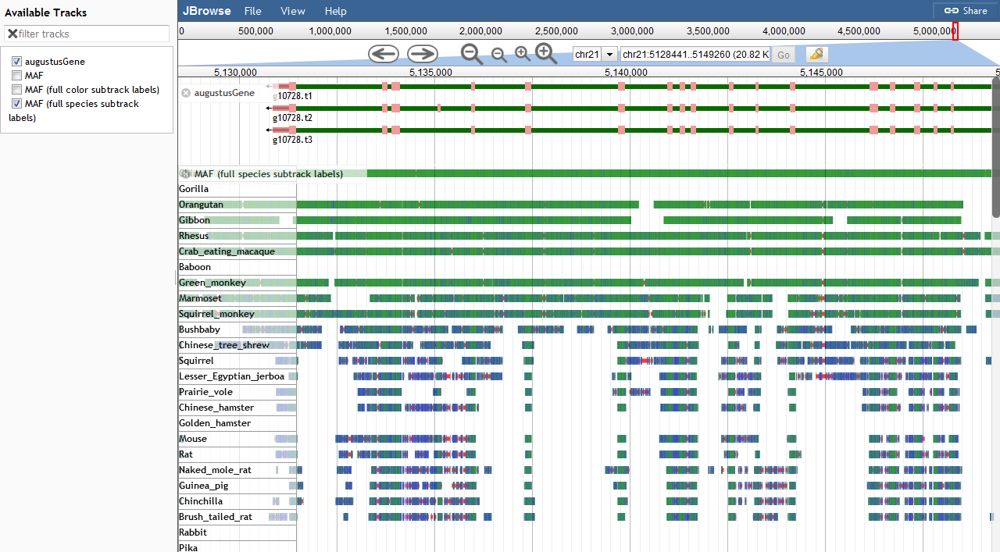

# mafviewer

A JBrowse plugin for viewing multiple alignments

## Prepare data

Convert the MAF into a pseudo-BED format by calling bin/maf2bed.pl

    bin/maf2bed.pl hg38 < file.maf > output.txt
    bgzip output.txt
    tabix -p bed output.txt.gz

The second argument to maf2bed.pl is the genome version e.g. hg38 used for the main species in the MAF. 

If all is well, your BED file should have 6 columns, with `chr, start, end, id, score, alignment_data`, where `alignment_data` is separated between each species by `;` and each field in the alignment is separated by `:`.

Note: you can also stream from a gzipped MAF to the bgzipped bed

    gunzip -c chr21.maf.gz | bin/maf2bed.pl hg38 | bgzip > output.txt.gz

## Options

- samples - an array of species in the MAF file (e.g. hg38, mm10, etc.)
- labelWidth - an integer width for labels (default: 100)
- style.matchColor - color to use for matches (default: green)
- style.mismatchColor - color to use for mismatches (default: blue)
- style.gapColor - color to use for gaps in alignment (default: red)

## Example config

    {
      "label": "MAF",
      "urlTemplate": "chrI.txt.gz",
      "storeClass": "MAFViewer/Store/SeqFeature/MAF",
      "type": "MAFViewer/View/Track/MAF",
      "samples": [
        "cb4",
        "caeRem4",
        "caePb3",
        "caeSp111",
        "caeJap4"
      ]
    }

## Screenshot

## Installation

Download to the plugins/MAFViewer and add to your config file with

    "plugins": ["MAFViewer"]

See JBrowse FAQ on installing plugins

## Demo

The test/ directory contains sample data for C. Elegans (from UCSC) and Medaka (from Ensembl). Visit http://localhost/jbrowse/?data=plugins/MAFViewer/test/data or http://localhost/jbrowse/?data=plugins/MAFViewer/test/medaka to view

## Notes

Requires JBrowse master branch at time of writing for BEDTabix functionality

Feel free to provide feedback!
